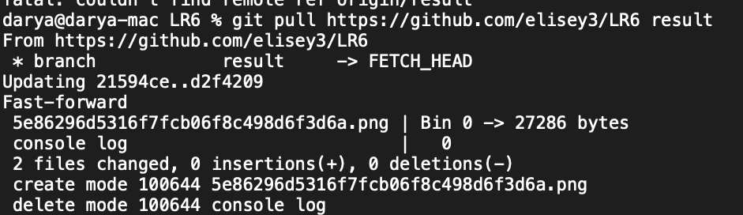

# LR6

Лабораторная работа №6

## Цель лаболаторной работы

изучение базовых возможностей системы управления версиями, опыт работы с Git Api, опыт работы с локальным и удаленным репозиторием.

## Команды терминала

```sh
Last login: Thu Nov  3 23:37:00 on ttys000
darya@darya-mac git 6 % git clone https://github.com/elisey3/LR6
Cloning into 'LR6'...
remote: Enumerating objects: 12, done.
remote: Total 12 (delta 0), reused 0 (delta 0), pack-reused 12
Receiving objects: 100% (12/12), done.
darya@darya-mac git 6 % cd ./LR6 
darya@darya-mac LR6 % git config user.name "4117 Eliseeva D.D."
darya@darya-mac LR6 % git config user.email "darya.eliseeva.3@gmail.com"
darya@darya-mac LR6 % touch text.txt
darya@darya-mac LR6 % ls text.txt 
text.txt
darya@darya-mac LR6 % git add text.txt 
darya@darya-mac LR6 % git commit -m "first commit"
[master 9276287] first commit
 1 file changed, 0 insertions(+), 0 deletions(-)
 create mode 100644 text.txt
darya@darya-mac LR6 % git push https://github.com/elisey3/LR6
Username for 'https://github.com': darya.eliseeva.3@gmail.com
Password for 'https://darya.eliseeva.3@gmail.com@github.com': 
Enumerating objects: 4, done.
Counting objects: 100% (4/4), done.
Delta compression using up to 10 threads
Compressing objects: 100% (2/2), done.
Writing objects: 100% (3/3), 315 bytes | 315.00 KiB/s, done.
Total 3 (delta 0), reused 0 (delta 0), pack-reused 0
To https://github.com/elisey3/LR6
   921f53b..9276287  master -> master
darya@darya-mac LR6 % git branch -a
* master
  remotes/origin/HEAD -> origin/master
  remotes/origin/branch1
  remotes/origin/master
darya@darya-mac LR6 % git checkout branch1
Branch 'branch1' set up to track remote branch 'branch1' from 'origin'.
Switched to a new branch 'branch1'
darya@darya-mac LR6 % git pull
From https://github.com/elisey3/LR6
   921f53b..9276287  master     -> origin/master
Already up to date.
darya@darya-mac LR6 % git branch -a       
* branch1
  master
  remotes/origin/HEAD -> origin/master
  remotes/origin/branch1
  remotes/origin/master
darya@darya-mac LR6 % git checkout master 
Switched to branch 'master'
Your branch is up to date with 'origin/master'.
darya@darya-mac LR6 % git log -a
commit 927628796221ee1d6528ff34d7c5bb7b1a7d309f (HEAD -> master, origin/master, origin/HEAD)
Author: 4117 Eliseeva D.D <darya.eliseeva.3@gmail.com>
Date:   Fri Nov 4 00:00:04 2022 +0300

    first commit

commit 921f53b8d0cebf542c791cf31f04e9b792f385a4
Author: Kurtyanik <45309985+Kurtyanik@users.noreply.github.com>
Date:   Sat Nov 21 20:09:49 2020 +0300

    Обновление информации

commit c08a654a63cfc3a7146b2b7015884d9020f5cbf5
Author: Kurtyanik <45309985+Kurtyanik@users.noreply.github.com>
Date:   Sat Nov 21 20:02:16 2020 +0300

    Файл создан пустым

commit 3c6e9131bb47ed6009c28226afb0535c7f6d5964
Author: Kurtyanik <45309985+Kurtyanik@users.noreply.github.com>
Date:   Sat Nov 21 19:58:20 2020 +0300

    Initial commit
darya@darya-mac LR6 % git log --all
commit 927628796221ee1d6528ff34d7c5bb7b1a7d309f (HEAD -> master, origin/master, origin/HEAD)
Author: 4117 Eliseeva D.D <darya.eliseeva.3@gmail.com>
Date:   Fri Nov 4 00:00:04 2022 +0300

    first commit

commit 921f53b8d0cebf542c791cf31f04e9b792f385a4
Author: Kurtyanik <45309985+Kurtyanik@users.noreply.github.com>
Date:   Sat Nov 21 20:09:49 2020 +0300

    Обновление информации

commit 0f9f50db68a6983b47398017545532cd0f992846 (origin/branch1, branch1)
Author: Kurtyanik <45309985+Kurtyanik@users.noreply.github.com>
Date:   Sat Nov 21 20:08:33 2020 +0300

    Заполнил файл

commit c08a654a63cfc3a7146b2b7015884d9020f5cbf5
Author: Kurtyanik <45309985+Kurtyanik@users.noreply.github.com>
Date:   Sat Nov 21 20:02:16 2020 +0300

    Файл создан пустым

commit 3c6e9131bb47ed6009c28226afb0535c7f6d5964
Author: Kurtyanik <45309985+Kurtyanik@users.noreply.github.com>
Date:   Sat Nov 21 19:58:20 2020 +0300

    Initial commit
darya@darya-mac LR6 % git merge branch1
Auto-merging mergefile.txt
CONFLICT (content): Merge conflict in mergefile.txt
Automatic merge failed; fix conflicts and then commit the result.
darya@darya-mac LR6 % git add mergefile.txt 
darya@darya-mac LR6 % git commite -m "fix conflict"
git: 'commite' is not a git command. See 'git --help'.

The most similar command is
	commit
darya@darya-mac LR6 % git commit -m "fix conflict" 
[master 6dac5e0] fix conflict
darya@darya-mac LR6 % git push https://github.com/elisey3/LR6
Enumerating objects: 7, done.
Counting objects: 100% (7/7), done.
Delta compression using up to 10 threads
Compressing objects: 100% (3/3), done.
Writing objects: 100% (3/3), 464 bytes | 464.00 KiB/s, done.
Total 3 (delta 0), reused 0 (delta 0), pack-reused 0
To https://github.com/elisey3/LR6
   9276287..6dac5e0  master -> master
darya@darya-mac LR6 % git branch -d branch1
Deleted branch branch1 (was 0f9f50d).
darya@darya-mac LR6 % git push origin -d branch1
To https://github.com/elisey3/LR6
 - [deleted]         branch1
darya@darya-mac LR6 % touch "console log"
darya@darya-mac LR6 % git add "console log" 
darya@darya-mac LR6 % git commit -m "create console log"
[master 8cca141] create console log
 1 file changed, 0 insertions(+), 0 deletions(-)
 create mode 100644 console log
darya@darya-mac LR6 % git push git https://github.com/elisey3/LR6
fatal: invalid refspec 'https://github.com/elisey3/LR6'
darya@darya-mac LR6 % git push https://github.com/elisey3/LR6 
Enumerating objects: 3, done.
Counting objects: 100% (3/3), done.
Delta compression using up to 10 threads
Compressing objects: 100% (2/2), done.
Writing objects: 100% (2/2), 332 bytes | 332.00 KiB/s, done.
Total 2 (delta 0), reused 0 (delta 0), pack-reused 0
To https://github.com/elisey3/LR6
   6dac5e0..8cca141  master -> master
darya@darya-mac LR6 % touch delete.txt
darya@darya-mac LR6 % ls delete.txt 
delete.txt
darya@darya-mac LR6 % git add delete.txt 
darya@darya-mac LR6 % git commit -m "delete commit"
[master 31e8f94] delete commit
 1 file changed, 0 insertions(+), 0 deletions(-)
 create mode 100644 delete.txt
darya@darya-mac LR6 % git log
commit 31e8f9447dfef70c6fae6432b53653318d414a2e (HEAD -> master)
Author: 4117 Eliseeva D.D <darya.eliseeva.3@gmail.com>
Date:   Fri Nov 4 00:14:41 2022 +0300

    delete commit

commit 8cca1416d990e6e7ff317bb2a543e2c6135bfb9b
Author: 4117 Eliseeva D.D <darya.eliseeva.3@gmail.com>
Date:   Fri Nov 4 00:10:16 2022 +0300

    create console log

commit 6dac5e0d62eb16023040d1e7c3319e1948e57389
Merge: 9276287 0f9f50d
Author: 4117 Eliseeva D.D <darya.eliseeva.3@gmail.com>
Date:   Fri Nov 4 00:07:41 2022 +0300

    fix conflict

commit 927628796221ee1d6528ff34d7c5bb7b1a7d309f (origin/master, origin/HEAD)
Author: 4117 Eliseeva D.D <darya.eliseeva.3@gmail.com>
Date:   Fri Nov 4 00:00:04 2022 +0300

    first commit

commit 921f53b8d0cebf542c791cf31f04e9b792f385a4
Author: Kurtyanik <45309985+Kurtyanik@users.noreply.github.com>
Date:   Sat Nov 21 20:09:49 2020 +0300

    Обновление информации

commit 0f9f50db68a6983b47398017545532cd0f992846
Author: Kurtyanik <45309985+Kurtyanik@users.noreply.github.com>
Date:   Sat Nov 21 20:08:33 2020 +0300

    Заполнил файл

commit c08a654a63cfc3a7146b2b7015884d9020f5cbf5
Author: Kurtyanik <45309985+Kurtyanik@users.noreply.github.com>
Date:   Sat Nov 21 20:02:16 2020 +0300

    Файл создан пустым

commit 3c6e9131bb47ed6009c28226afb0535c7f6d5964
Author: Kurtyanik <45309985+Kurtyanik@users.noreply.github.com>
Date:   Sat Nov 21 19:58:20 2020 +0300

    Initial commit
darya@darya-mac LR6 % git reset --hard HEAD~
HEAD is now at 8cca141 create console log
darya@darya-mac LR6 % git log
commit 8cca1416d990e6e7ff317bb2a543e2c6135bfb9b (HEAD -> master)
Author: 4117 Eliseeva D.D <darya.eliseeva.3@gmail.com>
Date:   Fri Nov 4 00:10:16 2022 +0300

    create console log

commit 6dac5e0d62eb16023040d1e7c3319e1948e57389
Merge: 9276287 0f9f50d
Author: 4117 Eliseeva D.D <darya.eliseeva.3@gmail.com>
Date:   Fri Nov 4 00:07:41 2022 +0300

    fix conflict

commit 927628796221ee1d6528ff34d7c5bb7b1a7d309f (origin/master, origin/HEAD)
Author: 4117 Eliseeva D.D <darya.eliseeva.3@gmail.com>
Date:   Fri Nov 4 00:00:04 2022 +0300

    first commit

commit 921f53b8d0cebf542c791cf31f04e9b792f385a4
Author: Kurtyanik <45309985+Kurtyanik@users.noreply.github.com>
Date:   Sat Nov 21 20:09:49 2020 +0300

    Обновление информации

commit 0f9f50db68a6983b47398017545532cd0f992846
Author: Kurtyanik <45309985+Kurtyanik@users.noreply.github.com>
Date:   Sat Nov 21 20:08:33 2020 +0300

    Заполнил файл

commit c08a654a63cfc3a7146b2b7015884d9020f5cbf5
Author: Kurtyanik <45309985+Kurtyanik@users.noreply.github.com>
Date:   Sat Nov 21 20:02:16 2020 +0300

    Файл создан пустым

commit 3c6e9131bb47ed6009c28226afb0535c7f6d5964
Author: Kurtyanik <45309985+Kurtyanik@users.noreply.github.com>
Date:   Sat Nov 21 19:58:20 2020 +0300

    Initial commit
darya@darya-mac LR6 % git push https://github.com/elisey3/LR6
Everything up-to-date
darya@darya-mac LR6 % git branch result
darya@darya-mac LR6 % git branch
* master
  result
darya@darya-mac LR6 % git checkout result
Switched to branch 'result'
darya@darya-mac LR6 % git push https://github.com/elisey3/LR6
Total 0 (delta 0), reused 0 (delta 0), pack-reused 0
remote: 
remote: Create a pull request for 'result' on GitHub by visiting:
remote:      https://github.com/elisey3/LR6/pull/new/result
remote: 
To https://github.com/elisey3/LR6
 * [new branch]      result -> result
darya@darya-mac LR6 % git branch -a
  master
* result
  remotes/origin/HEAD -> origin/master
  remotes/origin/master
darya@darya-mac LR6 % git add ./image 
darya@darya-mac LR6 % git add README.md 
darya@darya-mac LR6 % git commit -m "process commit"
[result 665df61] process commit
 4 files changed, 46 insertions(+)
 create mode 100644 image/.DS_Store
 create mode 100644 image/6.png
 create mode 100644 image/8.png
darya@darya-mac LR6 % git push https://github.com/elisey3/LR6
Enumerating objects: 9, done.
Counting objects: 100% (9/9), done.
Delta compression using up to 10 threads
Compressing objects: 100% (7/7), done.
Writing objects: 100% (7/7), 109.75 KiB | 27.44 MiB/s, done.
Total 7 (delta 0), reused 0 (delta 0), pack-reused 0
To https://github.com/elisey3/LR6
   8cca141..665df61  result -> result
darya@darya-mac LR6 % git branch
  master
* result
darya@darya-mac LR6 % git branch -a
  master
* result
  remotes/origin/HEAD -> origin/master
  remotes/origin/master
  remotes/origin/result
darya@darya-mac LR6 % git log -all
error: switch `l` expects a numerical value
darya@darya-mac LR6 % git log --all
commit 665df61906efbc58cbe4d669f51c9515484bf0fc (HEAD -> result)
Author: 4117 Eliseeva D.D <darya.eliseeva.3@gmail.com>
Date:   Fri Nov 4 00:29:16 2022 +0300

    process commit

commit 8cca1416d990e6e7ff317bb2a543e2c6135bfb9b (origin/result, origin/master, origin/HEAD, master)
Author: 4117 Eliseeva D.D <darya.eliseeva.3@gmail.com>
Date:   Fri Nov 4 00:10:16 2022 +0300

    create console log

commit 6dac5e0d62eb16023040d1e7c3319e1948e57389
Merge: 9276287 0f9f50d
Author: 4117 Eliseeva D.D <darya.eliseeva.3@gmail.com>
Date:   Fri Nov 4 00:07:41 2022 +0300

    fix conflict

commit 927628796221ee1d6528ff34d7c5bb7b1a7d309f
Author: 4117 Eliseeva D.D <darya.eliseeva.3@gmail.com>
Date:   Fri Nov 4 00:00:04 2022 +0300

    first commit

commit 921f53b8d0cebf542c791cf31f04e9b792f385a4
Author: Kurtyanik <45309985+Kurtyanik@users.noreply.github.com>
Date:   Sat Nov 21 20:09:49 2020 +0300

    Обновление информации

commit 0f9f50db68a6983b47398017545532cd0f992846
Author: Kurtyanik <45309985+Kurtyanik@users.noreply.github.com>
Date:   Sat Nov 21 20:08:33 2020 +0300

    Заполнил файл

commit c08a654a63cfc3a7146b2b7015884d9020f5cbf5
Author: Kurtyanik <45309985+Kurtyanik@users.noreply.github.com>
Date:   Sat Nov 21 20:02:16 2020 +0300

    Файл создан пустым

commit 3c6e9131bb47ed6009c28226afb0535c7f6d5964
Author: Kurtyanik <45309985+Kurtyanik@users.noreply.github.com>
Date:   Sat Nov 21 19:58:20 2020 +0300

    Initial commit
darya@darya-mac LR6 % touch history.txt
darya@darya-mac LR6 % ls history.txt 
history.txt
darya@darya-mac LR6 % git add history.txt 
darya@darya-mac LR6 % git commit -m "process 2 commit"
[result 294949c] process 2 commit
 1 file changed, 0 insertions(+), 0 deletions(-)
 create mode 100644 history.txt
darya@darya-mac LR6 % git push https://github.com/elisey3/LR6
Enumerating objects: 3, done.
Counting objects: 100% (3/3), done.
Delta compression using up to 10 threads
Compressing objects: 100% (2/2), done.
Writing objects: 100% (2/2), 254 bytes | 254.00 KiB/s, done.
Total 2 (delta 1), reused 0 (delta 0), pack-reused 0
remote: Resolving deltas: 100% (1/1), completed with 1 local object.
To https://github.com/elisey3/LR6
   665df61..294949c  result -> result
darya@darya-mac LR6 % git log --all
commit 294949c77c20f876f3037bd0f27446498d06aaa3 (HEAD -> result)
Author: 4117 Eliseeva D.D <darya.eliseeva.3@gmail.com>
Date:   Fri Nov 4 00:32:04 2022 +0300

    process 2 commit

commit 665df61906efbc58cbe4d669f51c9515484bf0fc
Author: 4117 Eliseeva D.D <darya.eliseeva.3@gmail.com>
Date:   Fri Nov 4 00:29:16 2022 +0300

    process commit

commit 8cca1416d990e6e7ff317bb2a543e2c6135bfb9b (origin/result, origin/master, origin/HEAD, master)
Author: 4117 Eliseeva D.D <darya.eliseeva.3@gmail.com>
Date:   Fri Nov 4 00:10:16 2022 +0300

    create console log

commit 6dac5e0d62eb16023040d1e7c3319e1948e57389
Merge: 9276287 0f9f50d
Author: 4117 Eliseeva D.D <darya.eliseeva.3@gmail.com>
Date:   Fri Nov 4 00:07:41 2022 +0300

    fix conflict

commit 927628796221ee1d6528ff34d7c5bb7b1a7d309f
Author: 4117 Eliseeva D.D <darya.eliseeva.3@gmail.com>
Date:   Fri Nov 4 00:00:04 2022 +0300

    first commit

commit 921f53b8d0cebf542c791cf31f04e9b792f385a4
Author: Kurtyanik <45309985+Kurtyanik@users.noreply.github.com>
Date:   Sat Nov 21 20:09:49 2020 +0300

    Обновление информации

commit 0f9f50db68a6983b47398017545532cd0f992846
Author: Kurtyanik <45309985+Kurtyanik@users.noreply.github.com>
Date:   Sat Nov 21 20:08:33 2020 +0300

    Заполнил файл

commit c08a654a63cfc3a7146b2b7015884d9020f5cbf5
Author: Kurtyanik <45309985+Kurtyanik@users.noreply.github.com>
Date:   Sat Nov 21 20:02:16 2020 +0300

    Файл создан пустым

commit 3c6e9131bb47ed6009c28226afb0535c7f6d5964
Author: Kurtyanik <45309985+Kurtyanik@users.noreply.github.com>
Date:   Sat Nov 21 19:58:20 2020 +0300

    Initial commit
darya@darya-mac LR6 % git add ./image 
darya@darya-mac LR6 % git add README.md 
darya@darya-mac LR6 % git add "console log.txt" 
darya@darya-mac LR6 % git commit -m "process 3"
[result 21594ce] process 3
 10 files changed, 894 insertions(+), 3 deletions(-)
 create mode 100644 console log.txt
 create mode 100644 image/0.png
 create mode 100644 image/1.png
 create mode 100644 image/2.png
 create mode 100644 image/3.png
 create mode 100644 image/4.png
 create mode 100644 image/5.png
 create mode 100644 image/7.png
darya@darya-mac LR6 % git push https://github.com/elisey3/LR6
Enumerating objects: 17, done.
Counting objects: 100% (17/17), done.
Delta compression using up to 10 threads
Compressing objects: 100% (13/13), done.
Writing objects: 100% (13/13), 727.83 KiB | 33.08 MiB/s, done.
Total 13 (delta 1), reused 0 (delta 0), pack-reused 0
remote: Resolving deltas: 100% (1/1), completed with 1 local object.
To https://github.com/elisey3/LR6
   294949c..21594ce  result -> result
darya@darya-mac LR6 % git pull
remote: Enumerating objects: 6, done.
remote: Counting objects: 100% (6/6), done.
remote: Compressing objects: 100% (5/5), done.
remote: Total 5 (delta 2), reused 0 (delta 0), pack-reused 0
Unpacking objects: 100% (5/5), 27.72 KiB | 9.24 MiB/s, done.
From https://github.com/elisey3/LR6
   294949c..d2f4209  result     -> origin/result
There is no tracking information for the current branch.
Please specify which branch you want to merge with.
See git-pull(1) for details.

    git pull <remote> <branch>

If you wish to set tracking information for this branch you can do so with:

    git branch --set-upstream-to=origin/<branch> result

darya@darya-mac LR6 % git pull
There is no tracking information for the current branch.
Please specify which branch you want to merge with.
See git-pull(1) for details.

    git pull <remote> <branch>

If you wish to set tracking information for this branch you can do so with:

    git branch --set-upstream-to=origin/<branch> result

darya@darya-mac LR6 % git pull https://github.com/elisey3/LR6
From https://github.com/elisey3/LR6
 * branch            HEAD       -> FETCH_HEAD
hint: Pulling without specifying how to reconcile divergent branches is
hint: discouraged. You can squelch this message by running one of the following
hint: commands sometime before your next pull:
hint: 
hint:   git config pull.rebase false  # merge (the default strategy)
hint:   git config pull.rebase true   # rebase
hint:   git config pull.ff only       # fast-forward only
hint: 
hint: You can replace "git config" with "git config --global" to set a default
hint: preference for all repositories. You can also pass --rebase, --no-rebase,
hint: or --ff-only on the command line to override the configured default per
hint: invocation.
Already up to date.
darya@darya-mac LR6 % git branch -a
  master
* result
  remotes/origin/HEAD -> origin/master
  remotes/origin/master
  remotes/origin/result
darya@darya-mac LR6 % git pull https://github.com/elisey3/LR6 origin/result
fatal: couldnt find remote ref origin/result
darya@darya-mac LR6 % git pull https://github.com/elisey3/LR6 result       
From https://github.com/elisey3/LR6
 * branch            result     -> FETCH_HEAD
Updating 21594ce..d2f4209
Fast-forward
 5e86296d5316f7fcb06f8c498d6f3d6a.png | Bin 0 -> 27286 bytes
 console log                          |   0
 2 files changed, 0 insertions(+), 0 deletions(-)
 create mode 100644 5e86296d5316f7fcb06f8c498d6f3d6a.png
 delete mode 100644 console log
darya@darya-mac LR6 % git log --all
commit d2f4209d07de9b5616d670d82d2c7f7e7f4d2d34 (HEAD -> result, origin/result)
Author: elisey3 <117370432+elisey3@users.noreply.github.com>
Date:   Fri Nov 4 00:51:42 2022 +0300

    one more mem

commit 9aa2e16267f3930841cfdf72e0b513b444ecfc09
Author: elisey3 <117370432+elisey3@users.noreply.github.com>
Date:   Fri Nov 4 00:48:52 2022 +0300

    Delete old ver file

commit 21594ce8a8dc39dd60da172a8b0e50f82e71a0ce
Author: 4117 Eliseeva D.D <darya.eliseeva.3@gmail.com>
Date:   Fri Nov 4 00:47:18 2022 +0300

    process 3

commit 294949c77c20f876f3037bd0f27446498d06aaa3
Author: 4117 Eliseeva D.D <darya.eliseeva.3@gmail.com>
Date:   Fri Nov 4 00:32:04 2022 +0300

    process 2 commit

commit 665df61906efbc58cbe4d669f51c9515484bf0fc
Author: 4117 Eliseeva D.D <darya.eliseeva.3@gmail.com>
Date:   Fri Nov 4 00:29:16 2022 +0300

    process commit

commit 8cca1416d990e6e7ff317bb2a543e2c6135bfb9b (origin/master, origin/HEAD, master)
Author: 4117 Eliseeva D.D <darya.eliseeva.3@gmail.com>
Date:   Fri Nov 4 00:10:16 2022 +0300

    create console log

commit 6dac5e0d62eb16023040d1e7c3319e1948e57389
Merge: 9276287 0f9f50d
Author: 4117 Eliseeva D.D <darya.eliseeva.3@gmail.com>
Date:   Fri Nov 4 00:07:41 2022 +0300

    fix conflict

commit 927628796221ee1d6528ff34d7c5bb7b1a7d309f
Author: 4117 Eliseeva D.D <darya.eliseeva.3@gmail.com>
Date:   Fri Nov 4 00:00:04 2022 +0300

    first commit

commit 921f53b8d0cebf542c791cf31f04e9b792f385a4
Author: Kurtyanik <45309985+Kurtyanik@users.noreply.github.com>
Date:   Sat Nov 21 20:09:49 2020 +0300

    Обновление информации

commit 0f9f50db68a6983b47398017545532cd0f992846
Author: Kurtyanik <45309985+Kurtyanik@users.noreply.github.com>
Date:   Sat Nov 21 20:08:33 2020 +0300

    Заполнил файл

commit c08a654a63cfc3a7146b2b7015884d9020f5cbf5
Author: Kurtyanik <45309985+Kurtyanik@users.noreply.github.com>
Date:   Sat Nov 21 20:02:16 2020 +0300

    Файл создан пустым

commit 3c6e9131bb47ed6009c28226afb0535c7f6d5964
Author: Kurtyanik <45309985+Kurtyanik@users.noreply.github.com>
Date:   Sat Nov 21 19:58:20 2020 +0300


zsh: suspended  git log --all
darya@darya-mac LR6 % git log --all
commit d2f4209d07de9b5616d670d82d2c7f7e7f4d2d34 (HEAD -> result, origin/result)
Author: elisey3 <117370432+elisey3@users.noreply.github.com>
Date:   Fri Nov 4 00:51:42 2022 +0300

    one more mem

commit 9aa2e16267f3930841cfdf72e0b513b444ecfc09
Author: elisey3 <117370432+elisey3@users.noreply.github.com>
Date:   Fri Nov 4 00:48:52 2022 +0300

    Delete old ver file

commit 21594ce8a8dc39dd60da172a8b0e50f82e71a0ce
Author: 4117 Eliseeva D.D <darya.eliseeva.3@gmail.com>
Date:   Fri Nov 4 00:47:18 2022 +0300

    process 3

commit 294949c77c20f876f3037bd0f27446498d06aaa3
Author: 4117 Eliseeva D.D <darya.eliseeva.3@gmail.com>
Date:   Fri Nov 4 00:32:04 2022 +0300

    process 2 commit

commit 665df61906efbc58cbe4d669f51c9515484bf0fc
Author: 4117 Eliseeva D.D <darya.eliseeva.3@gmail.com>
Date:   Fri Nov 4 00:29:16 2022 +0300

    process commit

commit 8cca1416d990e6e7ff317bb2a543e2c6135bfb9b (origin/master, origin/HEAD, master)
Author: 4117 Eliseeva D.D <darya.eliseeva.3@gmail.com>
Date:   Fri Nov 4 00:10:16 2022 +0300

    create console log

commit 6dac5e0d62eb16023040d1e7c3319e1948e57389
Merge: 9276287 0f9f50d
Author: 4117 Eliseeva D.D <darya.eliseeva.3@gmail.com>
Date:   Fri Nov 4 00:07:41 2022 +0300

    fix conflict

commit 927628796221ee1d6528ff34d7c5bb7b1a7d309f
Author: 4117 Eliseeva D.D <darya.eliseeva.3@gmail.com>
Date:   Fri Nov 4 00:00:04 2022 +0300

    first commit

commit 921f53b8d0cebf542c791cf31f04e9b792f385a4
Author: Kurtyanik <45309985+Kurtyanik@users.noreply.github.com>
Date:   Sat Nov 21 20:09:49 2020 +0300

    Обновление информации

commit 0f9f50db68a6983b47398017545532cd0f992846
Author: Kurtyanik <45309985+Kurtyanik@users.noreply.github.com>
Date:   Sat Nov 21 20:08:33 2020 +0300

    Заполнил файл

commit c08a654a63cfc3a7146b2b7015884d9020f5cbf5
Author: Kurtyanik <45309985+Kurtyanik@users.noreply.github.com>
Date:   Sat Nov 21 20:02:16 2020 +0300

    Файл создан пустым

commit 3c6e9131bb47ed6009c28226afb0535c7f6d5964
Author: Kurtyanik <45309985+Kurtyanik@users.noreply.github.com>
Date:   Sat Nov 21 19:58:20 2020 +0300

    Initial commit

zsh: suspended  git log --all
darya@darya-mac LR6 % 
```

## Ход работы

* Клонируем репозиторий и настраиваем профиль
    
* Скачиваем вторую ветку
    
* Выводим всю историю
    
* Сливаем 2 ветки в одну
    
* Удаляем вторую ветку
    
* Создаем комит, который будем удалять
    
    пакпка до
    
* Удаляем этот комит
    
    папка после
    
* Создаем файл в удаленном репозитории и обновляем локальный
     
     
* Финальная история изменений

``` sh
darya@darya-mac LR6 % git log --all
commit d2f4209d07de9b5616d670d82d2c7f7e7f4d2d34 (HEAD -> result, origin/result)
Author: elisey3 <117370432+elisey3@users.noreply.github.com>
Date:   Fri Nov 4 00:51:42 2022 +0300

    one more mem

commit 9aa2e16267f3930841cfdf72e0b513b444ecfc09
Author: elisey3 <117370432+elisey3@users.noreply.github.com>
Date:   Fri Nov 4 00:48:52 2022 +0300

    Delete old ver file

commit 21594ce8a8dc39dd60da172a8b0e50f82e71a0ce
Author: 4117 Eliseeva D.D <darya.eliseeva.3@gmail.com>
Date:   Fri Nov 4 00:47:18 2022 +0300

    process 3

commit 294949c77c20f876f3037bd0f27446498d06aaa3
Author: 4117 Eliseeva D.D <darya.eliseeva.3@gmail.com>
Date:   Fri Nov 4 00:32:04 2022 +0300

    process 2 commit

commit 665df61906efbc58cbe4d669f51c9515484bf0fc
Author: 4117 Eliseeva D.D <darya.eliseeva.3@gmail.com>
Date:   Fri Nov 4 00:29:16 2022 +0300

    process commit

commit 8cca1416d990e6e7ff317bb2a543e2c6135bfb9b (origin/master, origin/HEAD, master)
Author: 4117 Eliseeva D.D <darya.eliseeva.3@gmail.com>
Date:   Fri Nov 4 00:10:16 2022 +0300

    create console log

commit 6dac5e0d62eb16023040d1e7c3319e1948e57389
Merge: 9276287 0f9f50d
Author: 4117 Eliseeva D.D <darya.eliseeva.3@gmail.com>
Date:   Fri Nov 4 00:07:41 2022 +0300

    fix conflict

commit 927628796221ee1d6528ff34d7c5bb7b1a7d309f
Author: 4117 Eliseeva D.D <darya.eliseeva.3@gmail.com>
Date:   Fri Nov 4 00:00:04 2022 +0300

    first commit

commit 921f53b8d0cebf542c791cf31f04e9b792f385a4
Author: Kurtyanik <45309985+Kurtyanik@users.noreply.github.com>
Date:   Sat Nov 21 20:09:49 2020 +0300

    Обновление информации

commit 0f9f50db68a6983b47398017545532cd0f992846
Author: Kurtyanik <45309985+Kurtyanik@users.noreply.github.com>
Date:   Sat Nov 21 20:08:33 2020 +0300

    Заполнил файл

commit c08a654a63cfc3a7146b2b7015884d9020f5cbf5
Author: Kurtyanik <45309985+Kurtyanik@users.noreply.github.com>
Date:   Sat Nov 21 20:02:16 2020 +0300

    Файл создан пустым

commit 3c6e9131bb47ed6009c28226afb0535c7f6d5964
Author: Kurtyanik <45309985+Kurtyanik@users.noreply.github.com>
Date:   Sat Nov 21 19:58:20 2020 +0300

    Initial commit

```

## Вывод

Мы изучили базовые возможности системы управления версиями, получили опыт работы с Git Api и опыт работы с локальным и удаленным репозиторием.